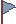
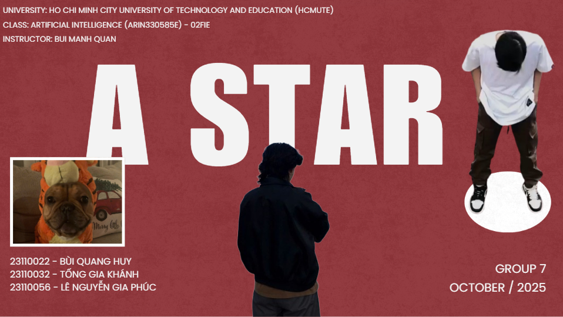

# 🧭 Weighted A* Pathfinding Visualizer
**Interactive visualization of A*, Weighted A*, Heuristics, Monsters, and Animated Characters — built with Python & Pygame.**

<p align="center">
  
</p>

---

## 🎯 Overview

**weighted-astar-visualizer** is an advanced visual tool for studying and comparing A* and Weighted A* on grid-based maps.  
It includes monster tiles with extra movement cost, animated characters, map editing tools, key–goal logic, and a history system for comparing heuristics and weights.

This project focuses on **algorithm visualization**, not gameplay.

---

# 🖼️ Assets Preview

### 🔹 Floor & Wall
<p align="center">
  
  
</p>

### 🔹 Start, Goal, Key, Chest
<p align="center">
  
  
  
  
  
</p>

### 🔹 Monsters
<p align="center">
  <br>
  <br>
  <br>
  
</p>

### 🔹 Player Animation
<p align="center">
  <br>
  <i>Idle spritesheet</i>
</p>

<p align="center">
  <br>
  <i>Walk spritesheet</i>
</p>

---

# 🧠 Pathfinding Theory

## ✔️ A* Evaluation Function

A* selects nodes based on:

\`\`\`
f(n) = g(n) + h(n)
\`\`\`

- **g(n)** — actual cost from start  
- **h(n)** — heuristic estimate to goal  

A* is optimal when *h* is admissible and consistent.

---

## ✔️ Weighted A*

Weighted A* adds a multiplier **W** to the heuristic:

\`\`\`
f(n) = g(n) + W * h(n)
\`\`\`

- **W = 1** → standard A*  
- **W > 1** → greedier, faster, may lose optimality  
- **W < 1** → more uniform-cost-search-like  

Weighted A* lets you experiment with how aggressive heuristics affect performance.

---

## ✔️ Supported Heuristics

| Heuristic | Movement | Formula |
|----------|----------|---------|
| Manhattan | 4-dir | `\|dx\| + \|dy\|` |
| Euclidean | 8-dir | `sqrt(dx² + dy²)` |
| Octile | 8-dir (diag = √2) | `max(dx,dy) + (√2−1)*min(dx,dy)` |
| Chebyshev | 8-dir (diag = 1) | `max(dx,dy)` |

Each heuristic aligns with different movement models.

---

## ✔️ Monster Tile Cost

Each monster tile increases movement cost:

\`\`\`
step_cost = base_cost + monster_extra_cost
\`\`\`

• Goblin, Mushroom, Skeleton, and Bat each have distinct animation & cost levels.  
This simulates dangerous terrain or RPG-like enemy zones.

---

## ✔️ Two-Leg Pathfinding  
### (Start → Key → Goal)

If a **key** is placed:

\`\`\`
A* #1 : start → key
A* #2 : key → goal
Merged final path
\`\`\`

This simulates multi-objective navigation.

---

## 📑 Presentation (Canva)

<p align="center">
  <a href="https://www.canva.com/design/DAG1GTSRemQ/HHaK8nVoA7WztnxbH1Unbg/edit?utm_content=DAG1GTSRemQ&utm_campaign=designshare&utm_medium=link2&utm_source=sharebutton">
    
  </a>
</p>

<p align="center"><i>Click the image to view the full Canva presentation</i></p>

# 📁 Project Structure

```
weighted-astar-visualizer/
│
├── assets/
│   ├── floor.png
│   ├── wall.png
│   ├── start.png
│   ├── goal.png
│   ├── key_0.png ...
│   ├── chest_idle_0.png ...
│   ├── monster_goblin_idle.png
│   ├── monster_mushroom_idle.png
│   ├── monster_skeleton_idle.png
│   ├── monster_bat_flight.png
│   ├── runner_idle.png
│   ├── runner_walk.png
│
└── src/
    ├── main.py
    ├── astar.py
    ├── grid.py
    ├── sprite.py
    ├── ui.py
    ├── settings.py
    └── __init__.py
```


# ✨ Author
**Bùi Quang Huy**  
Weighted A* Visualizer – Python & Pygame
